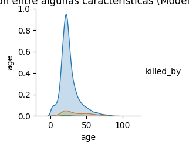
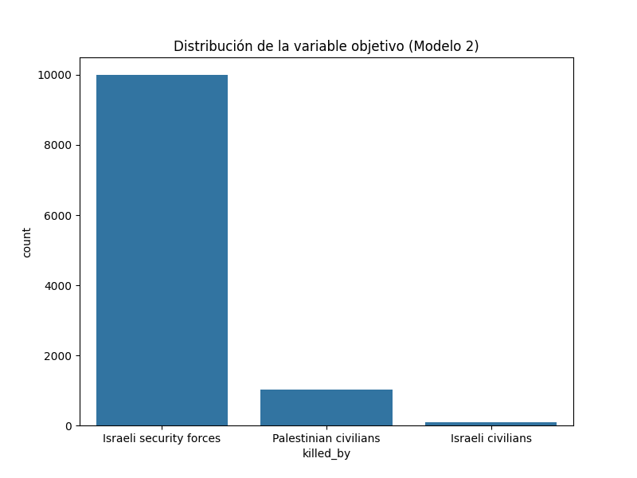

# Proyecto final Mineria de Datos

Sobre fatalidades provocadas por Israel hacia Palestina entre el 2000 a 2023

---

## Capturas

### img 1


### img 2


### img 3


### img 4


---

## Dependencias

Instalar pandas para manipulación de datos
```bash
pip install pandas
```

Instalar matplotlib y seaborn para visualización de datos
```bash
pip install matplotlib seaborn
```

Instalar scikit-learn para modelos de aprendizaje de máquina
```bash
pip install scikit-learn
```

Si decides utilizar el modelo K Vecinos Más Cercanos (KNN) en el Modelo 2, necesitarás también instalar la biblioteca para KNN
```bash
pip install kneighborsclassifier
```